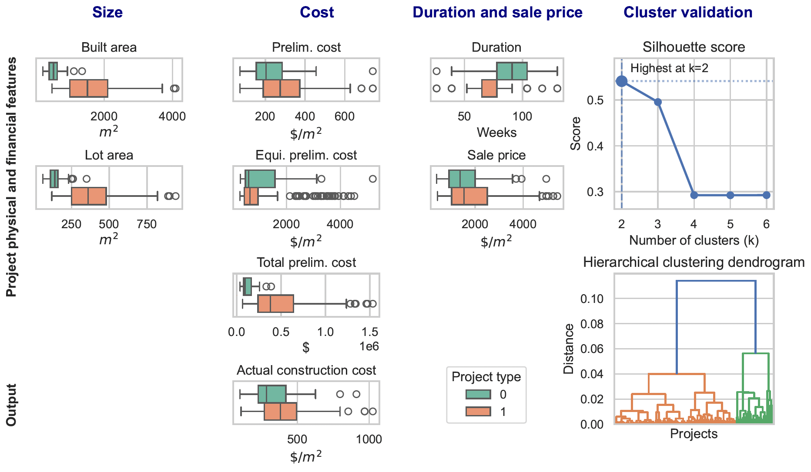
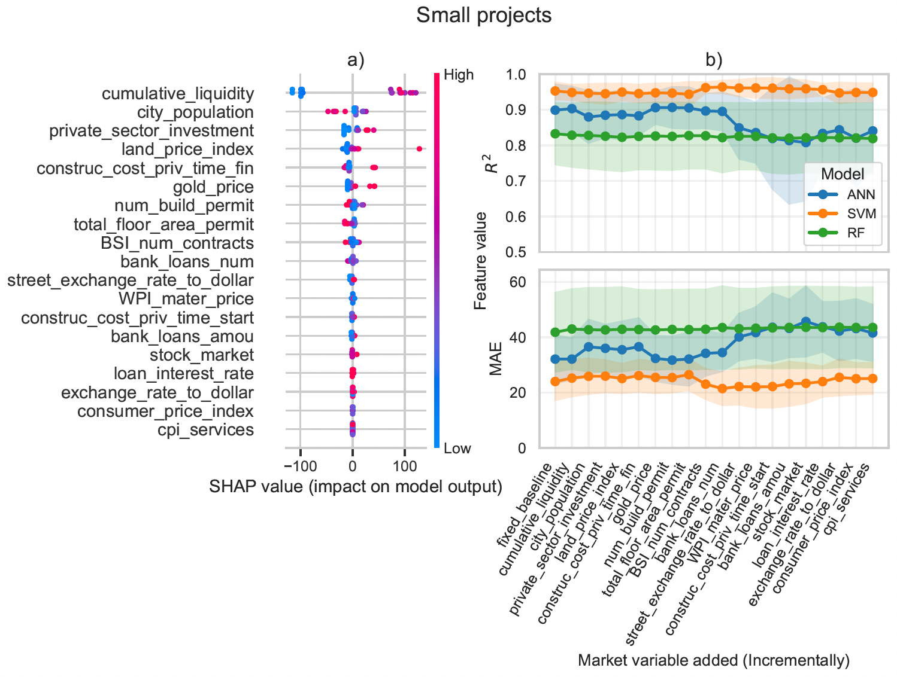
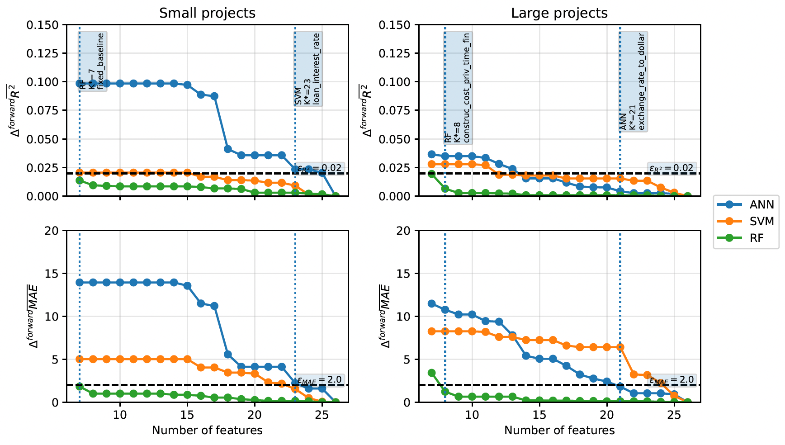

# 🏗️ Uncertainty-Aware Construction Cost Prediction  
### Explainable ML + Feature Saturation + Scale-Aware Modeling

## Overview

This project proposes a **data-driven and uncertainty-aware framework** for construction cost prediction, integrating:

- Project segmentation (clustering)
- Machine Learning models (ANN, RF, SVR)
- Explainability (SHAP)
- Feature saturation analysis for informational efficiency

Unlike traditional approaches that treat projects as homogeneous, this framework explicitly models **scale-dependent behavior** and evaluates **when additional information stops improving predictions**.

---

## Key Contributions

- **Uncertainty-aware modeling**: distinguishes between *necessary* and *complementary* information under market variability  
- **Feature saturation criterion (K\*)**: identifies the minimum number of features required for stable model performance  
- **Explainable AI integration**: SHAP-based feature importance guides incremental model building  
- **Scale-aware learning**: separate models for small and large projects reveal different cost dynamics  
- **Experimental rigor**: repeated cross-validation with mean ± std reporting ensures robustness  

---

## Methodology

The pipeline follows a structured multi-layer approach:

### 1. Data Processing
- Outlier removal using IQR-based filtering  
- Feature scaling for clustering and ANN training  
- Separation of:
  - Project-specific features (baseline)
  - Market-related features (incremental)

### 2. Project Segmentation
- Hierarchical clustering  
- Optimal selection of clusters (K=2) via:
  - Dendrogram analysis  
  - Silhouette score  



### 3. Modeling
Models trained per cluster:
- Artificial Neural Networks (ANN)  
- Random Forest (RF)  
- Support Vector Regression (SVR)  

Training strategy:
- Fixed baseline (project features)  
- Incremental addition of market features (SHAP-ranked)  

### 4. Explainability
- SHAP values used to:
  - Rank features globally  
  - Interpret marginal contribution  
  - Guide feature inclusion  

### 5. Saturation Analysis

The saturation point **K\*** is defined as:

```math
K^* = \min \left\{ k \mid 
\max(\overline{R^2}_{k:n}) - \min(\overline{R^2}_{k:n}) < \epsilon_{R^2}
\ \wedge \
\max(\overline{MAE}_{k:n}) - \min(\overline{MAE}_{k:n}) < \epsilon_{MAE}
\right\}

```
This ensures:
- Stability of performance
- Avoidance of unnecessary complexity
- Identification of informational efficiency

---

## Results
- ANN consistently outperforms RF and SVR
- Small projects:
    - Strong dependence on market variables
    - No clear saturation under defined thresholds
    
- Large projects:
    - High predictive stability
    - Saturation achieved with fewer relevant variables


---

## Key insight:
More data ≠ better models.
The value of information is scale-dependent and saturates.

---

## ⚙️ Installation
```bash
git clone https://github.com/cdtm15/uncertainty-cost-prediction.git
cd uncertainty-cost-prediction
pip install -r requirements.txt
```
---

## Author
**PhD.(C) Cristian David Tobar Montilla**
- Machine Learning & Data Science Researcher
- Focus: Uncertainty-aware ML, Explainable AI, Construction Analytics
- Experience: Applied ML, MLOps, Data-driven decision systems

